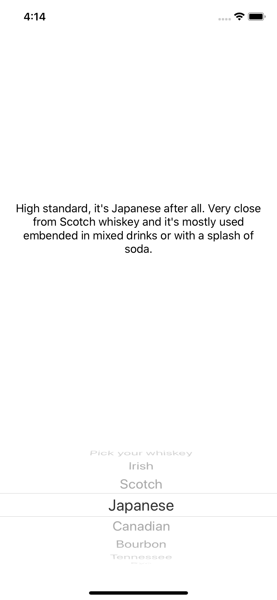

# enum_raw_values
<h2>Exercise with enumeration raw values and a UIpickerView:</h2>
<h3>Language: Swift 5.2</h3>
<h4>About:</h4>

This app shows a range of different whiskeys and their technical differences based on the user choice.

<h4>Exercise:</h4>

Enumeration using raw values, conformed to the ‘CaseIterable’ protocol.
Access the collection by using ‘allCases’ property and access its ‘rawValue’.

<h4>Reference:</h4>

https://docs.swift.org/swift-book/LanguageGuide/Enumerations.html

<h4>Instructions:</h4>

  <ol>
    <li>In the App and SceneDelegate, the following has been added below the import statement to be able to run with iOS 12.4 and above:
      @available (iOS 13.0, *)</li>
    <li>Don't forget to update your Bundle identifier and your provisioning profile after downloading the zip file.</li>
  </ol>
 

 <h4>Deployment target:</h4>
 

iOS 12.4 and above.

<h4>Screenshot:</h4>

